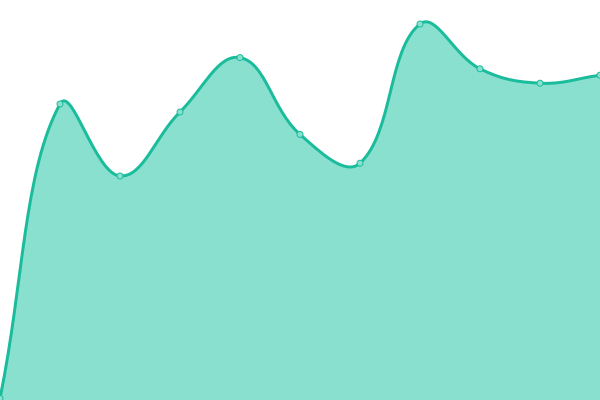

# [📈 Live Status](https://status.muetab.com): <!--live status--> **🟩 All systems operational**

This repository contains the open-source uptime monitor and status page for [Mue](https://muetab.com), powered by [Upptime](https://github.com/upptime/upptime).

With [Upptime](https://upptime.js.org), you can get your own unlimited and free uptime monitor and status page, powered entirely by a GitHub repository. We use [Issues](https://github.com/mue/status/issues) as incident reports, [Actions](https://github.com/mue/status/actions) as uptime monitors, and [Pages](https://status.muetab.com) for the status page.

<!--start: status pages-->
<!-- This summary is generated by Upptime (https://github.com/upptime/upptime) -->
<!-- Do not edit this manually, your changes will be overwritten -->

| URL                                                          | Status | History                                                                                       | Response Time                                                                       | Uptime                                                                                                                                                                                                          |
| ------------------------------------------------------------ | ------ | --------------------------------------------------------------------------------------------- | ----------------------------------------------------------------------------------- | --------------------------------------------------------------------------------------------------------------------------------------------------------------------------------------------------------------- |
| [Website](https://muetab.com)                                | 🟩 Up  | [website.yml](https://github.com/mue/status/commits/master/history/website.yml)               |  150ms        |                |
| [API](https://api.muetab.com)                                | 🟩 Up  | [api.yml](https://github.com/mue/status/commits/master/history/api.yml)                       |  474ms            |                        |
| [CDN](https://cdn.derpyenterprises.org/mue/mue_verified.svg) | 🟩 Up  | [cdn.yml](https://github.com/mue/status/commits/master/history/cdn.yml)                       |  79ms             |                        |
| [Marketplace](https://marketplace.muetab.com)                | 🟩 Up  | [marketplace.yml](https://github.com/mue/status/commits/master/history/marketplace.yml)       |  460ms    |        |
| [Blog](https://blog.muetab.com)                              | 🟩 Up  | [blog.yml](https://github.com/mue/status/commits/master/history/blog.yml)                     |  377ms           |                      |
| [Unsplash Proxy](https://unsplash.muetab.com)                | 🟩 Up  | [unsplash-proxy.yml](https://github.com/mue/status/commits/master/history/unsplash-proxy.yml) |  464ms |  |

<!--end: status pages-->

[**Visit our status website →**](https://status.muetab.com)

## 📄 License

- Code: [MIT](./LICENSE) © [Mue](https://muetab.com)
- Data in the `./history` directory: [Open Database License](https://opendatacommons.org/licenses/odbl/1-0/)
