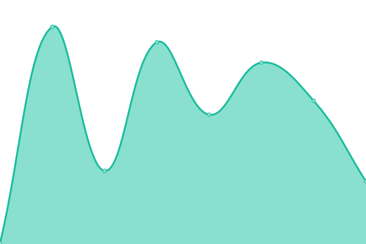

# [📈 Live Status](https://status.muetab.com): <!--live status--> **🟧 Partial outage**

This repository contains the open-source uptime monitor and status page for [Mue](https://muetab.com), powered by [Upptime](https://github.com/upptime/upptime).

With [Upptime](https://upptime.js.org), you can get your own unlimited and free uptime monitor and status page, powered entirely by a GitHub repository. We use [Issues](https://github.com/mue/status/issues) as incident reports, [Actions](https://github.com/mue/status/actions) as uptime monitors, and [Pages](https://status.muetab.com) for the status page.

<!--start: status pages-->
<!-- This summary is generated by Upptime (https://github.com/upptime/upptime) -->
<!-- Do not edit this manually, your changes will be overwritten -->
<!-- prettier-ignore -->
| URL | Status | History | Response Time | Uptime |
| --- | ------ | ------- | ------------- | ------ |
|  [Website](https://muetab.com) | 🟩 Up | [website.yml](https://github.com/mue/status/commits/HEAD/history/website.yml) | 

 1967ms
     
 | 

<a href="https://status.muetab.com/history/website">100.00%</a>
    

|  [API](https://api.muetab.com) | 🟩 Up | [api.yml](https://github.com/mue/status/commits/HEAD/history/api.yml) | 

 152ms
     
 | 

<a href="https://status.muetab.com/history/api">100.00%</a>
    

|  [CDN (Cloudinary)](https://res.cloudinary.com/mue/image/upload/photos/old/d7eb7a574e11fc43.jpg) | 🟥 Down | [cdn-cloudinary.yml](https://github.com/mue/status/commits/HEAD/history/cdn-cloudinary.yml) | 

 135ms
     
 | 

<a href="https://status.muetab.com/history/cdn-cloudinary">100.00%</a>
    

|  [Marketplace](https://marketplace.muetab.com) | 🟩 Up | [marketplace.yml](https://github.com/mue/status/commits/HEAD/history/marketplace.yml) | 

 708ms
     
 | 

<a href="https://status.muetab.com/history/marketplace">100.00%</a>
    

|  [Blog](https://blog.muetab.com) | 🟥 Down | [blog.yml](https://github.com/mue/status/commits/HEAD/history/blog.yml) | 

 116ms
     
 | 

<a href="https://status.muetab.com/history/blog">100.00%</a>
    

|  [Proxy](https://proxy.muetab.com) | 🟩 Up | [proxy.yml](https://github.com/mue/status/commits/HEAD/history/proxy.yml) | 

 259ms
     
 | 

<a href="https://status.muetab.com/history/proxy">100.00%</a>
    

|  [Docs](https://docs.muetab.com) | 🟩 Up | [docs.yml](https://github.com/mue/status/commits/HEAD/history/docs.yml) | 

 138ms
     
 | 

<a href="https://status.muetab.com/history/docs">100.00%</a>
    

<!--end: status pages-->

[**Visit our status website →**](https://status.muetab.com)

## 📄 License

- Code: [MIT](./LICENSE) (Upptime), [MIT](./assets/custom.css) (Custom CSS)
- Data in the `./history` directory: [Open Database License](https://opendatacommons.org/licenses/odbl/1-0/)
